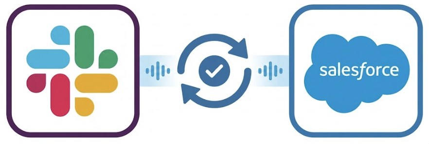
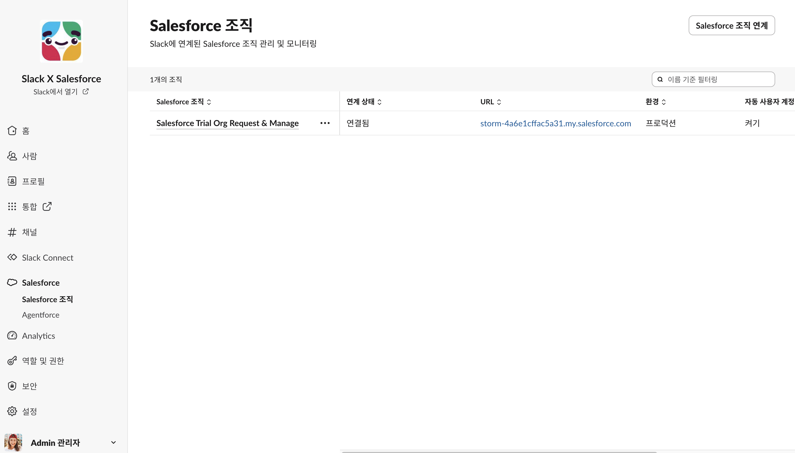

# Salesforce 조직
Salesforce에 Slack을 연결하면 팀이 Slack에서 바로 Salesforce 레코드를 확인하고 편집하고 알림을 받을 수 있습니다.

  

      

           
          Slack CRM 설정 가이드
      

      
      ❯
  

  

      

        
✔️ Slack CRM

        Slack에서 바로 이어지는 고객 여정 
        Salesforce 데이터와 연동해 메모·알림·후속 조치를 자동으로 처리합니다. 
         
        💡 추가 문의는 영업대표에게 연락 부탁드립니다. 
<table style="width: 100%; border-collapse: collapse; font-family: sans-serif; font-size: 14px; margin: 20px 0;">
  <thead>
    <tr style="border-top: 1px solid #d0d7de; border-bottom: 1px solid #d0d7de; background-color: #f6f8fa;">
      <th style="padding: 10px 14px; text-align: left; font-weight: 600; width: 25%; border: 1px solid #d0d7de; font-size: 13px;">항목</th>
      <th style="padding: 10px 14px; text-align: left; font-weight: 600; border: 1px solid #d0d7de;">내용</th>
    </tr>
  </thead>
  <tbody>
    <tr style="border-bottom: 1px solid #d0d7de;">
      <td style="padding: 10px 14px; font-weight: bold; border: 1px solid #d0d7de; font-size: 13px; color: #24292f;">지원 플랜</td>
      <td style="padding: 10px 14px; border: 1px solid #d0d7de; color: #24292f;"><strong>Business+ V2 전용</strong> (무료/Pro/Biz+ V1에서 업그레이드 가능)</td>
    </tr>
    <tr style="border-bottom: 1px solid #d0d7de;">
      <td style="padding: 10px 14px; font-weight: bold; border: 1px solid #d0d7de; font-size: 13px; color: #24292f;">사용자 제한</td>
      <td style="padding: 10px 14px; border: 1px solid #d0d7de; color: #24292f;">최대 100명</td>
    </tr>
    <tr style="border-bottom: 1px solid #d0d7de;">
      <td style="padding: 10px 14px; font-weight: bold; border: 1px solid #d0d7de; font-size: 13px; color: #24292f;">설정 방법</td>
      <td style="padding: 10px 14px; border: 1px solid #d0d7de; color: #24292f;">워크스페이스 이름 &gt; 환경설정 &gt; Salesforce</td>
    </tr>
  </tbody>
</table>
        
📌 설정 가이드

        실행 후, 실제 연동시간은 <strong>5분</strong>정도 소요됩니다.
        <video width="400" controls style="border-radius: 8px; box-shadow: 0 2px 5px rgba(0,0,0,0.06); border: 1px solid #e1e4e8; display: block;">
          <source src="https://github.com/minaslack/slackbizplus/releases/download/v1.0/SlackCRM.mp4" type="video/mp4">
        </video>
      

  

  

      

           
          Slack X Salesforce 연동 가이드
      

      
      ❯
  

  

      

        
✔️ Slack X Salesforce

        <strong>Salesforce + Slack 자동 통합 출시</strong>:tada::tada:  출시일 : 2026년 05월 15일 
         
        Enterprise/Unlimited Edition의 모든 신규 Salesforce 조직은 추가 설정 없이 즉시 사용 가능한 무료 Slack 워크스페이스(무료 플랜)를 자동으로 받게 됩니다. 
         
        해당 가이드는 <strong>기존 Salesforce 고객들도 무료 플랜이나 기존 Slack 워크스페이스를 함께 사용할 수 있는 연동 가이드</strong>입니다. 
        영상 가이드를 통해 간단한 연동 방법을,  
        아래 <strong>[Salesforce 채널: 구현 가이드]</strong>를 통해서 상세 가이드를 확인하실 수 있습니다. 
         
        💡 추가 문의는 영업대표에게 연락 부탁드립니다. 
         
        
📌 연동 가이드

        * 기존 워크스페이스 연계는 해당 영상 가이드를, 
        &nbsp;&nbsp;새 워크스페이스 생성은 아래 상세가이드를 참조 부탁드립니다. 
         
        <video width="400" controls style="border-radius: 8px; box-shadow: 0 2px 5px rgba(0,0,0,0.06); border: 1px solid #e1e4e8; display: block;">
          <source src="https://github.com/minaslack/slackbizplus/releases/download/v1.0/SlackXSalesforce.mp4" type="video/mp4">
        </video>
         
        <strong>참고 사항 : </strong> 
        1. 일반 사용자들이 Slack을 사용하기 위해서는 <strong>Salesforce에서의 사용자 이메일로 멤버 초대가 필요</strong>합니다. 
        2. <strong>선택한 개체에 Slack 버튼 표시 기능</strong>은 <strong>Release 262</strong>이상에 적용됩니다. 
         &nbsp;&nbsp;&nbsp;* 내 Org 릴리즈 버전 확인 방법 : 내 Org URL주소 + /releaseVersion.jsp 
        3. Salesforce 채널 활성화를 위해 <strong>무료 플랜에서도 무제한 메시지 보존</strong>을 지원합니다. 
        &nbsp;&nbsp;&nbsp;(Salesforce Pro Suite Licenses 이상) 
      

  

<!DOCTYPE html>
<html lang="ko">
<head>
  <meta charset="UTF-8">
  <meta name="viewport" content="width=device-width, initial-scale=1.0">
  <title>Slack Style Link Preview Card</title>
  
  <meta property="og:title" content="Salesforce Channels: Implementation Guide" />
  <meta property="og:description" content="Download our technical guide for a step-by-step walkthrough to help you configure Salesforce Channels." />
  <meta property="og:image" content="https://images.unsplash.com/photo-1618005182384-a83a8bd57fbe?q=80&w=400" />
  <meta property="og:site_name" content="Slack" />
  <meta property="og:type" content="website" />

  
</head>
<body>
  <a href="https://slack.com/intl/ko-kr/resources/slack-for-admins/salesforce-channels-implementation-guide" target="_blank" class="slack-card-container">
    

      

        <h3 class="card-main-title">Salesforce 채널: 구현 가이드</h3>
        

          Salesforce 채널 구성 시 도움이 되는 단계별 안내를 살펴보려면 기술 가이드를 다운로드하세요.
        

      

    

    

      
    

  </a>
</body>
</html>
 

